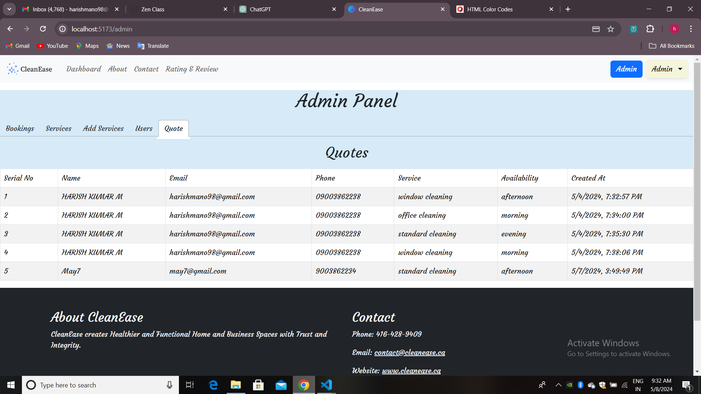
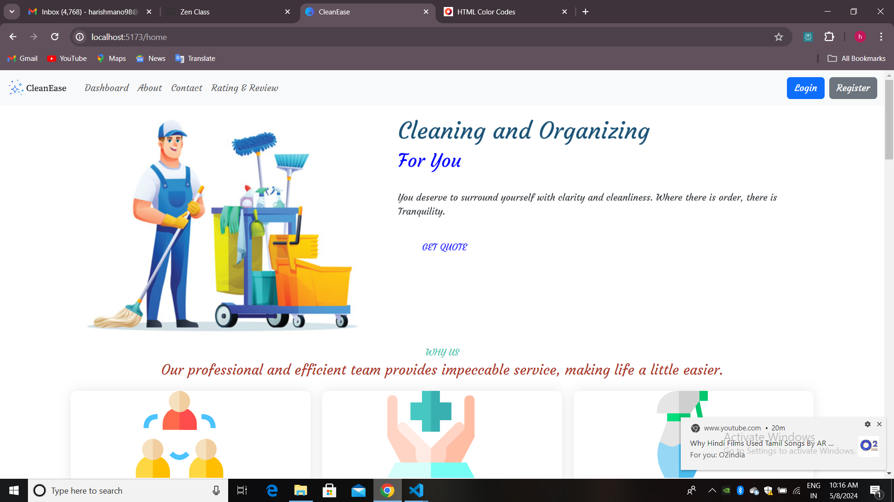

# CleanEase

## Introduction

Cleanease is a professional cleaning service company that takes the hassle out of maintaining a clean environment

## Admin Functionalities

### Admin credentials 

#### email : admin@gmail.com
#### pass  : admin@123 

Use this credentials to login and click  Admin button in the Navbar to go to admin page.

### 1. Admin Dashboard
The admin dashboard provides an overview of admin functionalities like Bookings , Services ,Addservices ,Users ,Quotes. Here's a screenshot of the admin dashboard with all the bookings made by the users.

In this bookings admin can delete a booking and it will reflect on the users booking page.

### 2. Manage Services
Admins can edit and delete services from the platform. Here's how the service management page looks:

### 3. Add Services
Admins can add services from the platform. Here's how the service management page looks:

### 4. Manage Users
Admins have the authority to manage users, including promoting users to admins or deleting user accounts. Below is a screenshot of the user management page:

### 4. Quotes
Admin can the quotes sent by the users .

## User Functionalities

### 1. User Dashboard
Upon clicking in, users are greeted with a personalized dashboard displaying a landing page.And click  get started to experience the website. Here's a snapshot of the user dashboard:

### 2. Register
Users can create an account by registering first.

### 3. Login
Users will be redirected to the login page after registering .
Remember to login To use  all functionalities.. If you are encountering problems it means to login...

### 4. Home
After logging in users can see the home page. If the user is Admin he will see admin button to go to admin page,but if not admin button will not show up.

### 5. Quotes
In the  home page users will see get quote button by clicking the button a modal will show up to a send quote to the admin.

### 6. Browsing Services
Users can see the available services and can search and filter by service availability and location.And user can sort the services by pricing too. Selectdate is to pick a date for booking.

### 7. Booking Services
Users can see the booking details and if the user is not logged in the name will not show and same for the date also and if the user is not logged in the booking will not happen.

### 7. Payment
Users can see the payment details after clicking pay now button.After it will redirect to home page.

### 8. User Profile
Users can see their  profile by clicking dropdown

After user can see their profile.

 

After user can see their bookings.

 

## Technologies Used

- HTML5
- CSS3
- JavaScript (ES6)
- React
- Bootstrap
- Sweetalert
- npm dependencies

## Installation

To run this project locally, follow these steps:

1. Clone this repository.
2. Install dependencies using `npm install`.
3. Start the development server with `npm start`.

